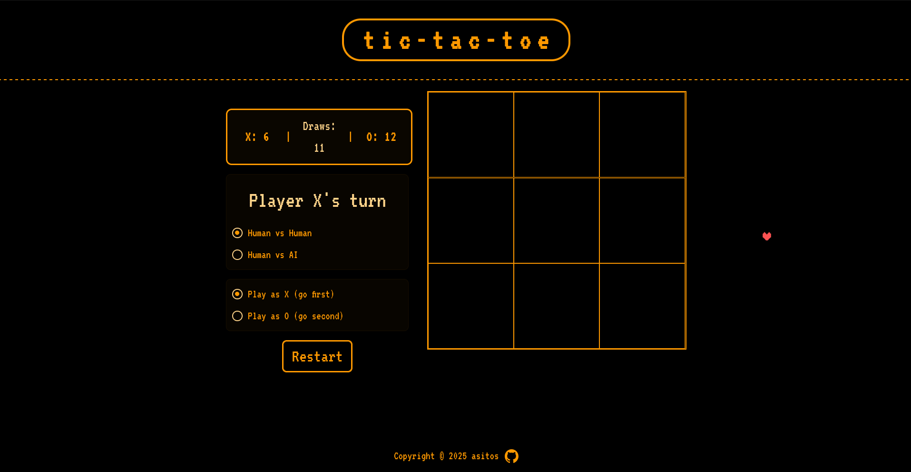
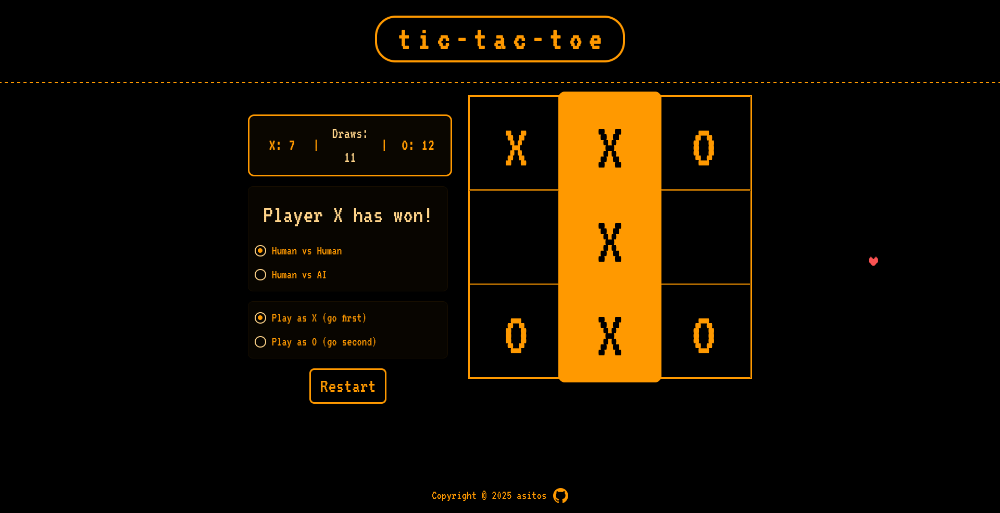

# T I C - T A C - T O E

a classic game of tic-tac-toe, built with pure **JavaScript**, **HTML**, and **CSS**, designed after undertale, being one of my favourite games.

## live demo

-   live at: https://asitos.github.io/tictactoe/

## screenshots



*Main game board, ready for the first move*



*Example of a completed game with a winner declared*

## what it does

-   play a classic 3x3 game of Tic-Tac-Toe against another person locally.
-   automatically alternates turns between 'X' and 'O'.
-   correctly identifies a "draw" game when no moves are left.
-   includes a "Restart" button to quickly start a new game.
-   minimax function based AI opponent.
-   clean, minimalist, and responsive design.
-   localStorage, or persistent storage for tracking score, and display them on the scoreboard

## technologies used

-   **HTML** - game board structure
-   **CSS** - all styling and layout
-   **Javascript** - handles all game logic (turn tracking, win detection, restart)

## how to run locally

1.  clone the repo

    ```bash
    git clone [https://github.com/asitos/tictactoe.git](https://github.com/asitos/tictactoe.git)
    ```

2.  open 'index.html' in your browser(eg. firefox)
    ```bash
    cd tictactoe
    firefox index.html
    ```

---